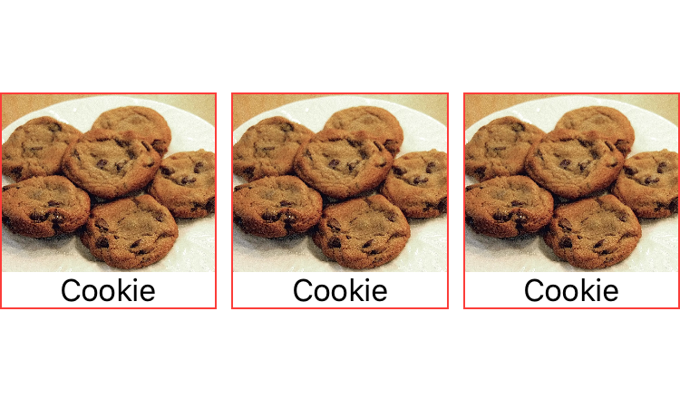

# SwiftUI playground

Runnable SwiftUI examples

* [How to clip image Views to a square](https://github.com/ralfebert/SwiftUIPlayground/blob/master/SwiftUIPlayground/Views/ClipImageSquareView.swift)
  

## Image copyrights

* Cookies:
  https://de.wikipedia.org/wiki/Datei:Chocolate_chip_cookies.jpg
