# SwiftUIPlayground

SwiftUIPlayground is a collection of SwiftUI example snippets:

SwiftUI view                             | UIKit View                                             | Example
---------------------------------------- | ------------------------------------------------------ | --------------------------------------------------------------------------
[Button][swiftui-button]                 | [UIButton][uikit-uibutton]                             | [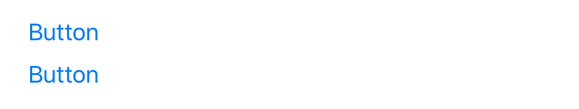][example-button]
[DatePicker][swiftui-datepicker]         | [UIDatePicker][uikit-uidatepicker]                     | [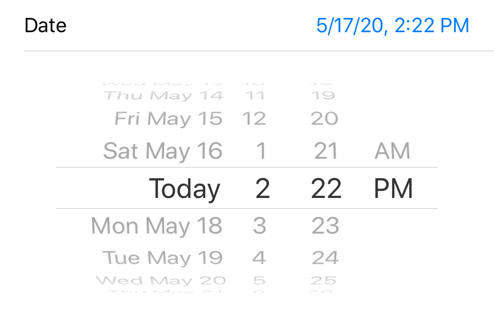][example-datepicker]
[EditButton][swiftui-editbutton]         |                                                        | [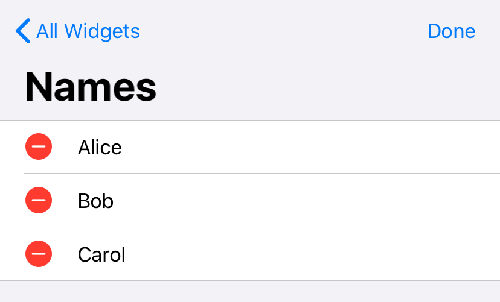][example-editbutton]
[Form][swiftui-form]                     |                                                        | [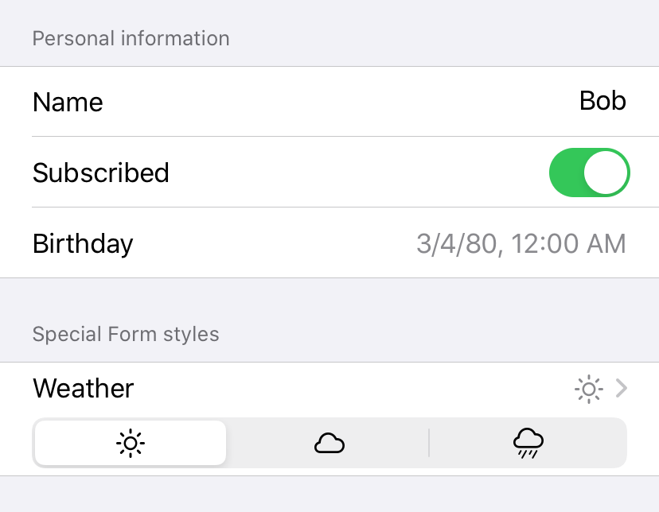][example-form]
[Image][swiftui-image]                   | [UIImageView][uikit-uiimageview]                       | [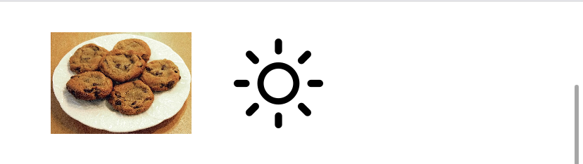][example-image]
[List][swiftui-list]                     | [UITableView][uikit-uitableview]                       | [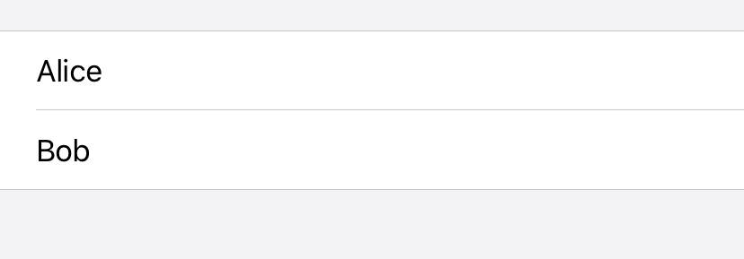][example-list]
[NavigationView][swiftui-navigationview] | [UINavigationController][uikit-uinavigationcontroller] | [][example-navigationview]
[Picker][swiftui-picker]                 | [UIPickerView][uikit-uipickerview]                     | [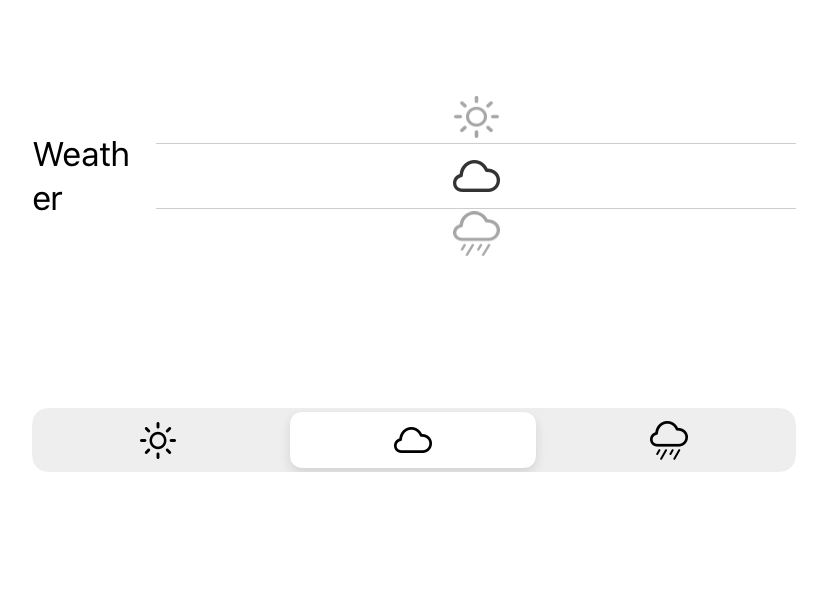][example-picker]
[ScrollView][swiftui-scrollview]         | [UIScrollView][uikit-uiscrollview]                     | [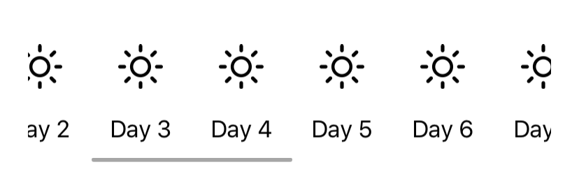][example-scrollview]
[Section][swiftui-section]               |                                                        | [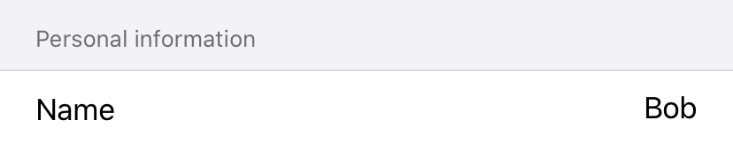][example-section]
[SecureField][swiftui-securefield]       | [UITextField][uikit-uitextfield]                       | [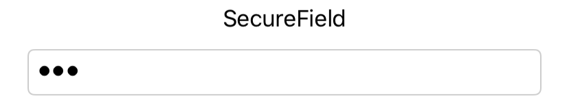][example-securefield]
[Slider][swiftui-slider]                 | [UISlider][uikit-uislider]                             | [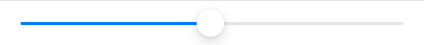][example-slider]
[Stepper][swiftui-stepper]               | [UIStepper][uikit-uistepper]                           | [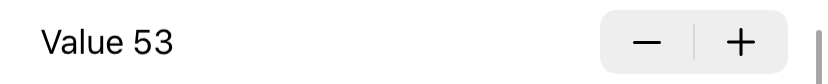][example-stepper]
[TabView][swiftui-tabview]               | [UITabBarController][uikit-uitabbarcontroller]         | [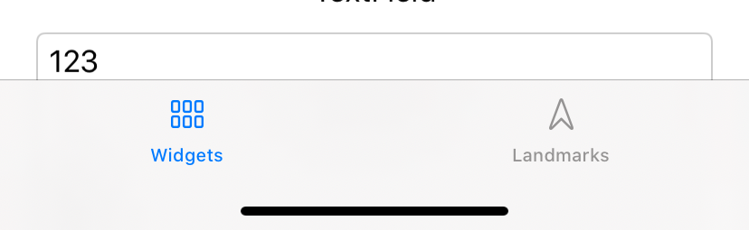][example-tabview]
[Text][swiftui-text]                     | [UILabel][uikit-uilabel]                               | [][example-text]
[TextField][swiftui-textfield]           | [UITextField][uikit-uitextfield]                       | [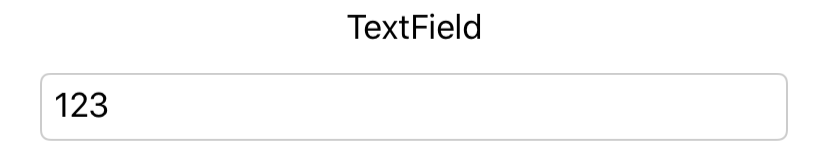][example-textfield]
[Toggle][swiftui-toggle]                 | [UISwitch][uikit-uiswitch]                             | [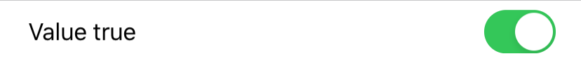][example-toggle]

[swiftui-button]: https://developer.apple.com/documentation/swiftui/button
[example-button]: https://github.com/ralfebert/SwiftUIPlayground/blob/master/SwiftUIPlayground/Views/ButtonExampleView.swift
[uikit-uibutton]: https://developer.apple.com/documentation/uikit/uibutton
[swiftui-datepicker]: https://developer.apple.com/documentation/swiftui/datepicker
[example-datepicker]: https://github.com/ralfebert/SwiftUIPlayground/blob/master/SwiftUIPlayground/Views/DatePickerExampleView.swift
[uikit-uidatepicker]: https://developer.apple.com/documentation/uikit/uidatepicker
[swiftui-editbutton]: https://developer.apple.com/documentation/swiftui/editbutton
[example-editbutton]: https://github.com/ralfebert/SwiftUIPlayground/blob/master/SwiftUIPlayground/Views/EditButtonExampleView.swift
[swiftui-form]: https://developer.apple.com/documentation/swiftui/form
[example-form]: https://github.com/ralfebert/SwiftUIPlayground/blob/master/SwiftUIPlayground/Views/ContactFormView.swift
[swiftui-image]: https://developer.apple.com/documentation/swiftui/image
[example-image]: https://github.com/ralfebert/SwiftUIPlayground/blob/master/SwiftUIPlayground/Views/ImageExampleView.swift
[uikit-uiimageview]: https://developer.apple.com/documentation/uikit/uiimageview
[swiftui-list]: https://developer.apple.com/documentation/swiftui/list
[example-list]: https://github.com/ralfebert/SwiftUIPlayground/blob/master/SwiftUIPlayground/Views/ListExampleView.swift
[uikit-uitableview]: https://developer.apple.com/documentation/uikit/uitableview
[swiftui-navigationview]: https://developer.apple.com/documentation/swiftui/navigationview
[example-navigationview]: https://github.com/ralfebert/SwiftUIPlayground/blob/master/SwiftUIPlayground/Views/NavigationViewExample.swift
[uikit-uinavigationcontroller]: https://developer.apple.com/documentation/uikit/uinavigationcontroller
[swiftui-picker]: https://developer.apple.com/documentation/swiftui/picker
[example-picker]: https://github.com/ralfebert/SwiftUIPlayground/blob/master/SwiftUIPlayground/Views/PickerExampleView.swift
[uikit-uipickerview]: https://developer.apple.com/documentation/uikit/uipickerview
[swiftui-scrollview]: https://developer.apple.com/documentation/swiftui/scrollview
[example-scrollview]: https://github.com/ralfebert/SwiftUIPlayground/blob/master/SwiftUIPlayground/Views/ScrollViewExample.swift
[uikit-uiscrollview]: https://developer.apple.com/documentation/uikit/uiscrollview
[swiftui-section]: https://developer.apple.com/documentation/swiftui/section
[example-section]: https://github.com/ralfebert/SwiftUIPlayground/blob/master/SwiftUIPlayground/Views/ContactFormView.swift
[swiftui-securefield]: https://developer.apple.com/documentation/swiftui/securefield
[example-securefield]: https://github.com/ralfebert/SwiftUIPlayground/blob/master/SwiftUIPlayground/Views/TextFieldExampleView.swift
[uikit-uitextfield]: https://developer.apple.com/documentation/uikit/uitextfield
[swiftui-slider]: https://developer.apple.com/documentation/swiftui/slider
[example-slider]: https://github.com/ralfebert/SwiftUIPlayground/blob/master/SwiftUIPlayground/Views/SliderExampleView.swift
[uikit-uislider]: https://developer.apple.com/documentation/uikit/uislider
[swiftui-stepper]: https://developer.apple.com/documentation/swiftui/stepper
[example-stepper]: https://github.com/ralfebert/SwiftUIPlayground/blob/master/SwiftUIPlayground/Views/StepperExampleView.swift
[uikit-uistepper]: https://developer.apple.com/documentation/uikit/uistepper
[swiftui-tabview]: https://developer.apple.com/documentation/swiftui/tabview
[example-tabview]: https://github.com/ralfebert/SwiftUIPlayground/blob/master/SwiftUIPlayground/Views/MainView.swift
[uikit-uitabbarcontroller]: https://developer.apple.com/documentation/uikit/uitabbarcontroller
[swiftui-text]: https://developer.apple.com/documentation/swiftui/text
[example-text]: https://github.com/ralfebert/SwiftUIPlayground/blob/master/SwiftUIPlayground/Views/TextExampleView.swift
[uikit-uilabel]: https://developer.apple.com/documentation/uikit/uilabel
[swiftui-textfield]: https://developer.apple.com/documentation/swiftui/textfield
[example-textfield]: https://github.com/ralfebert/SwiftUIPlayground/blob/master/SwiftUIPlayground/Views/TextFieldExampleView.swift
[uikit-uitextfield]: https://developer.apple.com/documentation/uikit/uitextfield
[swiftui-toggle]: https://developer.apple.com/documentation/swiftui/toggle
[example-toggle]: https://github.com/ralfebert/SwiftUIPlayground/blob/master/SwiftUIPlayground/Views/ToggleExampleView.swift
[uikit-uiswitch]: https://developer.apple.com/documentation/uikit/uiswitch

## Image copyrights

* Cookies:
  https://de.wikipedia.org/wiki/Datei:Chocolate_chip_cookies.jpg
